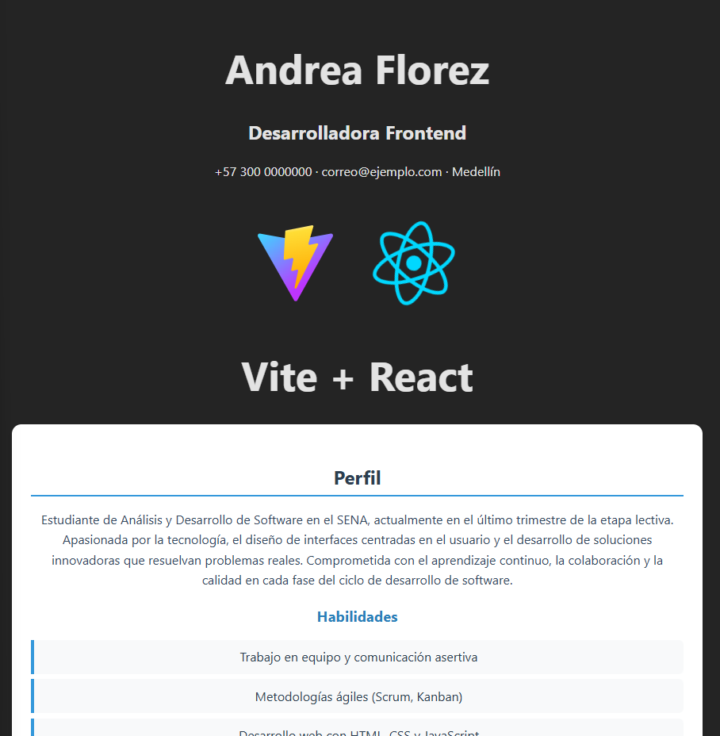

# CV Andrea Florez – Portafolio Personal

Este proyecto es una aplicación creada con **React + Vite** que muestra un currículum vitae digital. Incluye secciones como perfil profesional, experiencia, educación y contacto, con un diseño moderno y responsivo.

---

## 🖼️ Vista previa




---

## Tecnologías utilizadas

- ⚛️ **React** – Librería para interfaces de usuario.  
- ⚡ **Vite** – Herramienta de desarrollo rápida para React.  
- 🎨 **CSS** – Estilos personalizados.  

---

## Estructura del proyecto
```
📁cv-andrea-florez
    └── 📁public
        └── vite.svg
         └── screenshot.png
    └── 📁src
        └── App.jsx
        └── 📁components
          └── 📁HeaderCV/
                └── HeaderCV.jsx
                └── headerCV.css
           └── 📁Profile/
                └── Profile.jsx
                └──profile.css
            └── 📁Experience/
                  └── Experience.jsx
                  └── experience.css
             └── 📁Education/
                  └── Education.jsx
                  └──education.css
        └── index.css
        └── main.jsx
    └── .gitignore
    └── eslint.config.js
    └── index.html
    └── package-lock.json
    └── package.json
    └── README.md
    └── vite.config.js
```


## Instrucciones para ejecutar el proyecto

### 1️⃣ Clonar el repositorio
```
git clone https://github.com/ANDREAFL0REZ/CV_React_AndreaFlorez/tree/main/src/components
cd cv-andrea-florez
```

### 2️⃣ Instalar dependencias
```
npm install
```
### 3️⃣Iniciar el servidor de desarrollo
```
npm run dev
```

### 4️⃣ Abrir en el navegador

Haz clic en el enlace que aparece en la consola (generalmente):
http://localhost:5173/


